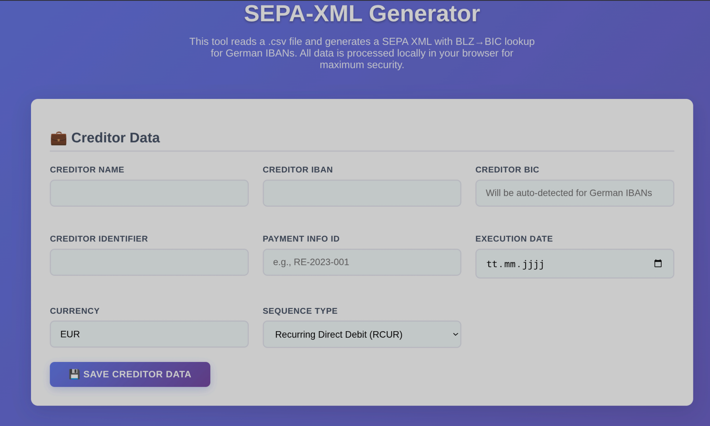

# 💰 SEPA-XML Generator

[](https://ansieger.github.io/SEPA-XML-Generator/)
[](LICENSE)
[]()

> 🏦 **Professional SEPA Direct Debit XML Generator** with automatic BLZ→BIC lookup for German banking

A modern, user-friendly web application that converts CSV files into compliant SEPA XML files (pain.008.001.08 format). Perfect for businesses and individuals who need to generate direct debit files for German and European banking systems.

## 🌟 Features

- ✅ **CSV to SEPA XML Conversion** - pain.008.001.08 format compliance
- ✅ **Automatic BLZ→BIC Lookup** - No manual BIC entry needed for German IBANs
- ✅ **100% Client-Side Processing** - Your data never leaves your browser
- ✅ **Modern UI/UX** - Clean, responsive design with dark mode support
- ✅ **No Registration Required** - Use immediately without sign-up
- ✅ **Privacy First** - No cookies, no tracking, no data collection
- ✅ **Mobile Friendly** - Works perfectly on all devices
- ✅ **Open Source** - Transparent and community-driven

## 📸 Preview



*Modern, intuitive interface with professional styling and clear workflow*

## 🚀 Quick Start

1. **Visit the tool**: [SEPA-XML Generator](https://ansieger.github.io/SEPA-XML-Generator/)
2. **Enter creditor data** (your business information)
3. **Upload CSV file** or manually enter debtor information
4. **Generate SEPA XML** and download instantly

## 📋 CSV Format

Your CSV file should follow this structure:

```csv
First Name;Last Name;Amount;IBAN;Purpose;Mandate;Identification;Issue Date
John;Doe;100.50;DE89370400440532013000;Monthly fee;MAND-001;CUSTOMER-001;2023-01-15
Jane;Smith;75.00;DE89370400440532013001;Service charge;MAND-002;CUSTOMER-002;2023-01-10
```

## 🛡️ Security & Privacy

- 🔒 **100% Local Processing** - All data remains in your browser
- 🚫 **No Server Upload** - Files are processed client-side only
- 🍪 **Cookie-Free** - No tracking or analytics cookies
- 📱 **Offline Capable** - Works without internet after initial load
- 🔐 **Open Source** - Code is publicly auditable

## ⚠️ Disclaimer

This tool is provided "as is" without warranty. Always verify generated XML files before submitting to your bank. Users are responsible for ensuring compliance with their bank's requirements and applicable regulations.

## 🛠️ Technology Stack

- **Frontend**: Vanilla JavaScript, HTML5, CSS3
- **Design**: Modern responsive design with CSS Grid/Flexbox
- **Data Processing**: Client-side CSV parsing and XML generation
- **BLZ Database**: German bank code to BIC mapping

## 🤝 Contributing

Contributions are welcome! Feel free to:
- 🐛 Report bugs
- 💡 Suggest new features
- 🔧 Submit pull requests
- ⭐ Star this repository

## 💝 Support

If you find this tool helpful, consider supporting its development:

[](https://www.buymeacoffee.com/ansieger)

## 📄 License

This project is licensed under the MIT License - see the [LICENSE](LICENSE) file for details.

---

<div align="center">

**Made with ❤️ by [AnSieger](https://github.com/AnSieger)**

[🌐 Try it now](https://ansieger.github.io/SEPA-XML-Generator/) • [⭐ Star on GitHub](https://github.com/AnSieger/SEPA-XML-Generator) • [☕ Buy me a coffee](https://www.buymeacoffee.com/ansieger)

</div>
